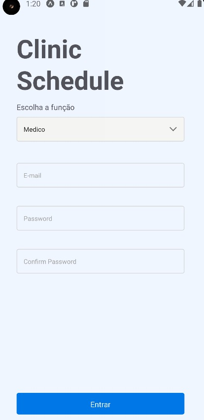
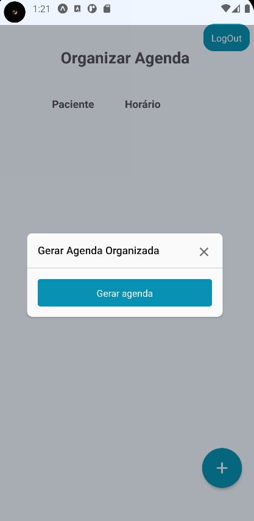

# Consult Schedule

**Número da Dupla**: 20 
**Conteúdo da Disciplina**: Algoritmos Ambiciosos 

## Alunos

| Matrícula  | Aluno        |
| ---------- | ------------ |
| 19/0024950 | Arthur Melo  |
| 18/0105604 | Luis Marques |

## Sobre

O projeto consiste em um app para um consultório medico, onde os pacientes podem fazer a indicação do horário de disponibilidade(inicio e final da disponibilidade) , a partir dai o sistema gera a ordem de atendimento a fim de gerar o atraso mínimo para o consultório e maximizar o tempo do medico.

## Screenshots

## Video de apresentação

[Video de Apresentação](medias/Trabalho%20Greed-20220725_222222-Meeting%20Recording.mp4)

## Instalação

**Linguagem**: JavaScrypt 
**Framework**: React,Native,Expo,firebase,native-base 
Descreva os pré-requisitos para rodar o seu projeto e os comandos necessários.

## Uso

    -  Aparelho Android 8.0 ou superior

## comandos para rodar o projeto

    - expo start a
